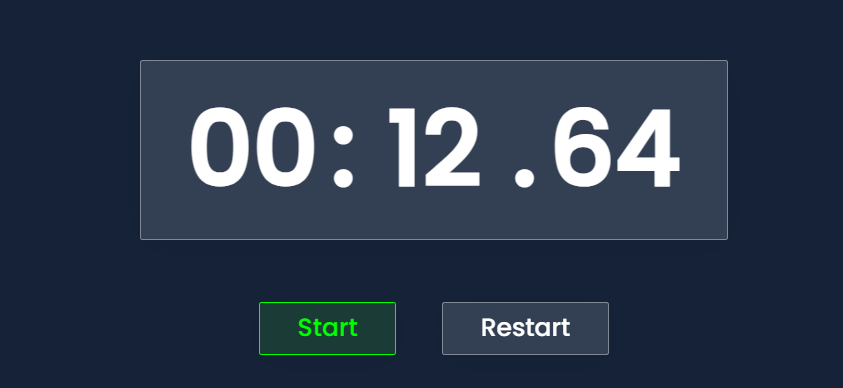

**Online Stopwatch and Timer Overview**

*Online Stopwatch and Timer Web Application* allows users to utilize both a stopwatch and a timer feature, each with their respective functionalities. The application is built using HTML, CSS, and JavaScript. You can access the application through the following link: [Online Stopwatch and Timer](https://ramprasadmanna.github.io/Online-Timer-StopWatch/).

The application consists of three main pages:

1. **Home Page**
   - The home page acts as the main navigation hub for users to choose between using the stopwatch or timer feature.
   - Users can select either the Stopwatch or Timer option to proceed to their desired functionality.

   

2. **Stopwatch Page**
   - The Stopwatch page displays a real-time stopwatch.

   

   - It has the following features:
     - **Start**: Click the "Start" button to start the stopwatch.

     

     - **Stop**: Click the "Stop" button to pause the stopwatch.

     

     - **Lap**: Click the "Lap" button to record a lap time. Lap times are displayed below the stopwatch.

     

     - **Reset**: Click the "Reset" button to reset the stopwatch and clear all recorded lap times.

     

     - **Note**: Users can write a small note for each lap, which is displayed alongside the lap time.

     

     - **Highlighting**: The fastest lap is highlighted in green, and the slowest lap is highlighted in red.

     
   
3. **Timer Page**
   - The Timer page allows users to set a specific countdown time.

   

   - It offers the following functionalities:
     - **Set Time**: Input the desired countdown time in hours, minutes, and seconds.

     

     - **Start**: Click the "Start" button to begin the countdown.

     

     - **Pause**: Click the "Pause" button to pause the countdown.

     

     - **Resume**: Click the "Resume" button to resume the countdown from where it was paused.
     
     

     - **Reset**: Click the "Reset" button to stop the timer and reset it to the initially set time.

     

     - **Alert**: When the countdown reaches zero, an alert is triggered to notify the user.

     
     

The application is designed to be responsive and functional across various screen sizes and devices, ensuring a smooth user experience.

We hope you find this application useful for your timing needs!